# ECF Architecture Lifecycle Diagram

This diagram represents the bootstrap and request lifecycle layers of the ECF framework, ordered from the core foundation level up to the user-facing presentation layers.

## Unicode Flow Diagram

```text
Foundation
    │
    ▼
Container
    │
    ▼
Application
    │
    ▼
Service Providers
    │
    ▼
Configuration
    │
    ▼
Logging
    │
    ▼
Environment
    │
    ▼
Events
    │
    ▼
Database
    │
    ▼
Routing
    │
    ▼
HTTP
    │
    ▼
Middleware
    │
    ▼
Controllers
    │
    ▼
Views
```

## Visual Architecture Flow (Mermaid)

Below is a visual representation of the framework's architecture stack:

```mermaid
flowchart TD
    %% Define Styles
    classDef foundation fill:#4f46e5,stroke:#4338ca,stroke-width:2px,color:#ffffff,font-weight:bold;
    classDef container fill:#0ea5e9,stroke:#0284c7,stroke-width:2px,color:#ffffff,font-weight:bold;
    classDef application fill:#06b6d4,stroke:#0891b2,stroke-width:2px,color:#ffffff,font-weight:bold;
    classDef providers fill:#10b981,stroke:#059669,stroke-width:2px,color:#ffffff,font-weight:bold;
    classDef config fill:#84cc16,stroke:#65a30d,stroke-width:2px,color:#ffffff,font-weight:bold;
    classDef logging fill:#eab308,stroke:#ca8a04,stroke-width:2px,color:#ffffff,font-weight:bold;
    classDef env fill:#f97316,stroke:#ea580c,stroke-width:2px,color:#ffffff,font-weight:bold;
    classDef events fill:#ef4444,stroke:#dc2626,stroke-width:2px,color:#ffffff,font-weight:bold;
    classDef db fill:#ec4899,stroke:#db2777,stroke-width:2px,color:#ffffff,font-weight:bold;
    classDef routing fill:#d946ef,stroke:#c026d3,stroke-width:2px,color:#ffffff,font-weight:bold;
    classDef http fill:#a855f7,stroke:#9333ea,stroke-width:2px,color:#ffffff,font-weight:bold;
    classDef middleware fill:#6366f1,stroke:#4f46e5,stroke-width:2px,color:#ffffff,font-weight:bold;
    classDef controllers fill:#14b8a6,stroke:#0d9488,stroke-width:2px,color:#ffffff,font-weight:bold;
    classDef views fill:#22c55e,stroke:#16a34a,stroke-width:2px,color:#ffffff,font-weight:bold;

    %% Nodes
    F[Foundation]:::foundation
    C[Container]:::container
    A[Application]:::application
    SP[Service Providers]:::providers
    CFG[Configuration]:::config
    LOG[Logging]:::logging
    ENV[Environment]:::env
    EVT[Events]:::events
    DB[Database]:::db
    R[Routing]:::routing
    HTTP[HTTP]:::http
    MW[Middleware]:::middleware
    CTL[Controllers]:::controllers
    V[Views]:::views

    %% Flow
    F --> C
    C --> A
    A --> SP
    SP --> CFG
    CFG --> LOG
    LOG --> ENV
    ENV --> EVT
    EVT --> DB
    DB --> R
    R --> HTTP
    HTTP --> MW
    MW --> CTL
    CTL --> V
```


